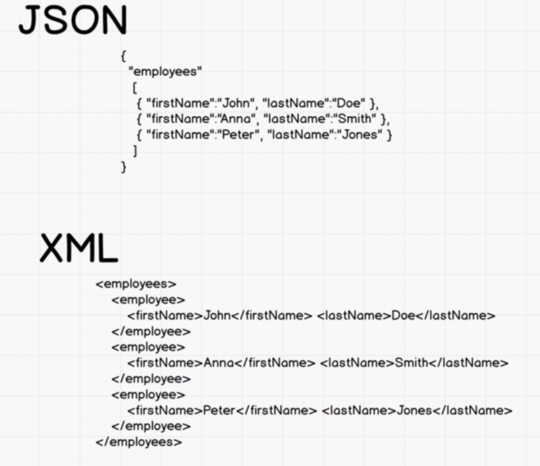

# JSON:
JavaScript Object Notation
JSON is a syntax for storing and exchanging data.
JSON is text, written with JavaScript object notation.
<figure>
    
    <figcaption><em>Fig. 1: JSON vs XML syntax </em></figcaption>
    <br><br>
</figure>
everything need to be a string<br>
JSON can be understood by any server language.<br>
Javascript come with its own functions

```js
JSON.parse(); //turn a JSON to an object
var obj = JSON.parse('{"name":"John","age":30, "city":"New York"}');
JSON.stringify();//turn an object to JSON
var myJSON = JSON.stringify(obj);
```
Originally, the only way to submit some form data to a server was through the <form> tag in HTML. As we have learned, it can do a POST or a GET request. With JSON you can now grab the contents of the <input> in a form and submit those with JSON instead of as a form data. You can now submit to the server whenever you want without it necessarily being a <form>, through AJAX.
 # AJAX:
